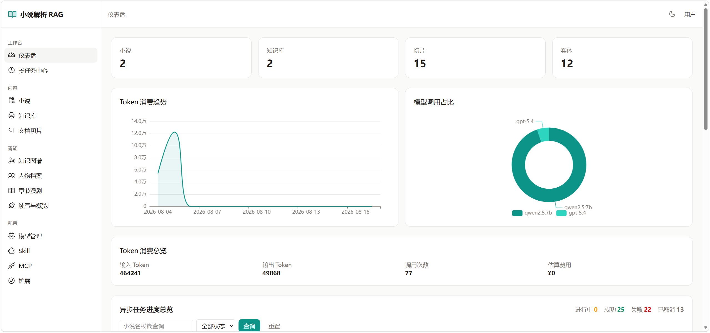
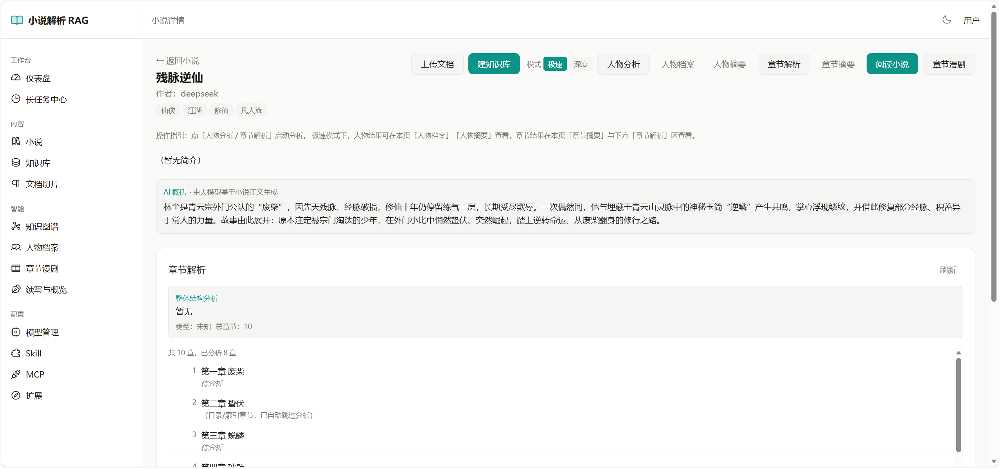
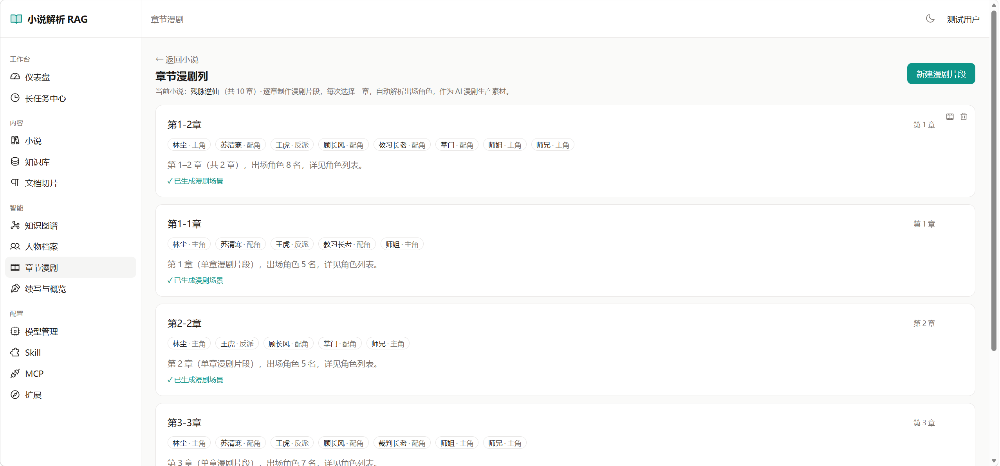
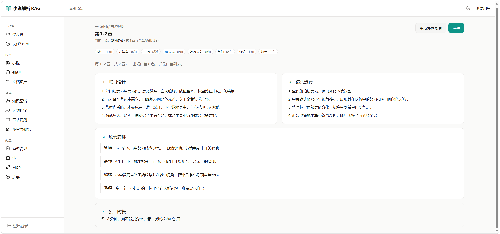
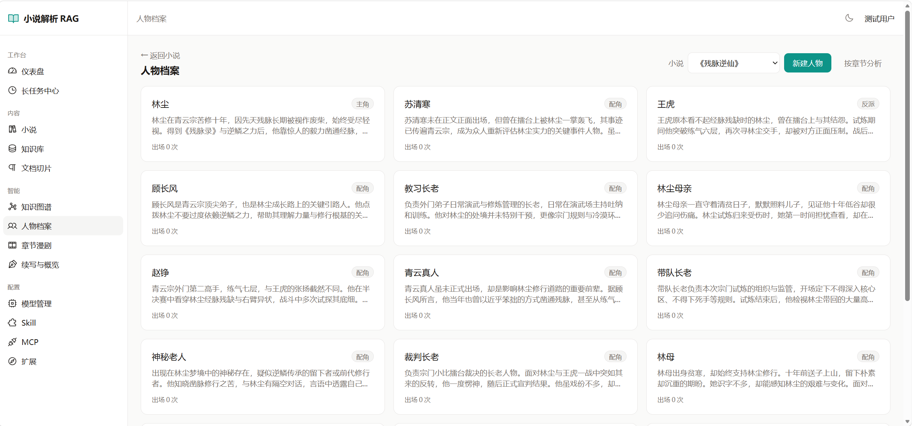

# 小说解析 RAG 系统

> AI 漫剧自动化生产流水线的**上游环节**：把原始小说解析为结构化、可检索、可对接生产的知识资产。

---

## 一、项目定位与作用

本项目是一套面向「小说 → AI 漫剧」自动生产链路的上游解析引擎。它解决的核心问题是：
**原始小说是长文本、非结构化、难以直接驱动下游生成**。本系统将小说解析为
章节、切片、人物档案、知识图谱、知识库等结构化资产，并通过向量检索与大模型能力，
为下游的 AI 漫剧生产工作流（分镜脚本生成、角色一致性设定、剧情线编排等）提供高质量、可消费的「原料」。

简言之：**上游把小说"读懂并拆好"，下游把素材"画出来、演出来"。**

---

## 二、面向群体

| 群体 | 使用场景 |
| --- | --- |
| **AI 漫剧 / 短剧生产团队** | 将版权小说快速转为可检索的结构化素材，对接分镜、出图、配音等下游工作流 |
| **网文 IP 运营方** | 批量解析自有小说库，沉淀人物、关系、世界观等知识资产，支撑二创与改编 |
| **RAG / AIGC 应用开发者** | 复用本系统的切片、向量化、图谱抽取、对话/续写等能力构建上层应用 |
| **个人创作者** | 上传小说即可获得人物卡、章节切片、智能问答，辅助改编与大纲设计 |

---

## 三、核心功能能力

系统能力按模块组织（M1–M22），覆盖「解析 → 向量化 → 知识提取 → 生成增强 → 运营」全链路。
数据库 Schema 版本化迁移脚本见 `story_sql/`（`V1`–`V24` 已落地，`V25` 为编排层检查点规划项，按序执行）。

### 1. 小说与文档解析（M1 / M2）
- 支持 TXT / EPUB / PDF / DOCX 上传（TXT≤50MB，其他≤200MB，见 `config.yml`）。
- 上传即做**前置校验**：扩展名白名单、`sha256` 内容去重（重复返回 409）、章节数上限 `MAX_CHAPTERS=5000`。
- 自动按章节边界切分（正则识别中文章节「第X章/卷/节/回/部/篇」、英文 `Chapter/Volume X`、Markdown `#` 标题），章节编号唯一、可拆分/合并（同小说内防越权）。
- 解析任务异步化，状态可追踪；解析失败可重试。

### 2. 切片与向量化（M3 / M4）
- **双切片策略**（`chunk_strategy`，存于 `kb.extra` 可经接口更新，下次构建生效）：
  - `chapter`（按章节）：每章一个切片；章节超 `size`（默认 1500 字）才按长度兜底拆。
  - `length`（滑动窗口，默认）：固定窗口 `size`（默认 800 字）+ `overlap`（默认 0 重叠）滑动。
  - 实测（合成小说 12 章）：`length 800/0` → 66 片；`length 500/100` → 120 片；`chapter 1500/0` → 36 片。压力测试 ~40 万字纯切分仅 9ms（0.016ms/片），本地切分开销极低。
- 嵌入模型经统一适配器分发（Ollama 本地 `/api/embed` 批量 / OpenAI 兼容协议），批大小 `EMBED_BATCH=32`。
- **向量库统一为 Chroma（按知识库分集合 `kb_{kb_id}` 持久化）**，PG 仅存业务字段，不再冗余存储向量（见 `V11_移除切片冗余向量列.sql`）。
- 切片浏览器：分页、章节筛选、关键词检索（`ILIKE`，分页 ≤100）、相似切片、屏蔽/启用（`disabled` 布尔位，检索时过滤）、**内容编辑并触发单条重向量化**——编辑仅做一条 PG UPDATE + 一条 Chroma `upsert(ids=[id])`，不触发全量重建。

### 3. 知识图谱（M5）
- 调用本地大模型从章节文本抽取实体与关系，幂等落库（按实体/关系去重，重复抽取不翻倍）。
- 输出前端图谱所需的 `{nodes, links, categories}` 结构，支撑剧情线与人物关系可视化。

### 4. 人物档案（M6）
- 人物卡 CRUD（同小说人物名唯一）。
- AI 生成小传：基于全文调用大模型产出结构化人物档案，并统计人物出场次数回填。
- **LangGraph 状态图编排（唯一路径）**：人物分析走 `extract → analyze → validate →(条件边回退) persist` 的 StateGraph；`session/cfg` 经 `config["configurable"]` 注入，避免全局状态。P2.5 起已移除 `LANGGRAPH_ENABLED` 开关与线性冗余实现（消除双份实现漂移）。
  - **P1 质量闭环**：`validate` 节点做零 LLM 成本的规则校验（role 白名单/identity 非空/description 长度/同批小传重复），不合格项经条件边回退重试（硬上限 2 轮），超限候选以 `needs_review` 兜底落库，不丢数据。
  - **P2 并发精析**：候选内 `asyncio.gather` 并发调 LLM，并发度受 `GRAPH_LLM_CONCURRENCY`（默认 4）约束；状态用 `Annotated` reducer 合并增量（实测 6 候选：并发 0.095s vs 串行 0.565s）。
  - **P3 持久化 checkpoint**：应用 lifespan 持有 `AsyncPostgresSaver`，支持断点续跑（`core/graph/checkpointer.py`）；依赖缺失或库不可达时自动降级为 `MemorySaver`。任务终态主动清理 checkpoint 防表膨胀。
- 按章节分析：选定小说部分章节（`chapter_ids`），仅对该范围正文抽取人物并写入人物档案。
- 单角色编辑：支持对每个人物卡的字段（身份/性别/性格/外貌/口头禅/简介）单独编辑维护。
- **确定性 + LLM 双层管道**：先用 jieba 零成本产出人物候选（`nlp.MIN_FREQ_STRICT=10` 严格阈值，全文出场 < 10 次不入库），再 LLM 逐候选精析小传，调用次数 = 候选数，避免旧版"分片抽全类"的冗余调用。
- **编排层增强路线（P1–P4）**：详见 `报告分析/LangGraph编排层增强方案.md` —— P1 质量闭环（validate 节点 + 条件边重试）、P2 并行扇出（`Send` + 状态 reducer）、P3 持久化 checkpoint（崩溃续跑 + 人工审核）、P4 扩展为项目级编排内核（Agentic RAG / 图谱分块并行）。

### 4.1 章节漫剧列（M15 / M21 / M22）
- 选定某小说的连续章节范围（起始/结束章节号，跨度 ≤ 5 章），记录为「漫剧片段」素材单元。
- 自动解析该范围内出场角色（匹配已有人物档案 + jieba 候选兜底），写入 `character_ids` 供下游 AI 漫剧生产消费。
- 章节漫剧场景（M22）：在漫剧片段基础上构建分镜级场景单元，列表/新建/详情/删除，前端菜单「章节漫剧」入口。

### 5. 对话与续写（M7 / M8）
- 人物对话（M7）：以人物卡为上下文与小说角色多轮对话。
- 续写（M8）：基于前文与角色设定进行情节续写，**支持流式输出**（token 级逐字推送）。
- 阅读助手对话（M16）：基于全文的问答式阅读辅助，支持采样参数配置。

### 6. 大模型适配与配置（M9 / M15 缓存）
- 统一适配器抽象 `LLMAdapter`：探活 / 嵌入 / 对话 / 流式对话。
- 双实现：`OllamaAdapter`（本地，免密钥）、`OpenAIAdapter`（OpenAI 兼容，覆盖智谱/通义/DeepSeek 等）。
- 模型配置管理（chat / embed / image 分类、默认分发链、Token 用量统计落 `story_llm_usage`）。
- 模型选型与缓存（M15）：模型缓存降低重复 LLM 调用开销。

### 7. 技能（M10）
- 技能库（M10）：内置/自定义 Prompt 技能，挂载到对话、续写、抽取等场景。

### 8. 扩展与运营（M13 / M14）
- 扩展能力（M13）：笔记、标签、收藏、审计日志、阅读进度，均按用户隔离。
- 仪表盘（M14）：资源统计、Token 用量、趋势、模型占比等聚合视图。
- 统一异步任务中心（见第四节）：长/短任务差异化展示，进度全局可观测。

---

## 四、异步任务与可检测性

所有耗时后台任务（解析 / 切割向量化 / 图谱抽取 / 人物生成）共用**统一异步任务框架**，保证全流程异步且可检测：

- **统一任务表 `story_async_task`**（V8）：`type`(parse/chunk/graph/character)、`stage`(preparing/chunking/embedding/storing/done)、`progress`(0–100)、`status`(pending→running→success/failed/cancelled)、`error`、`tokens_in/out`、`extra`(回放/重试上下文)。V19 新增 `is_long_task` / `estimated_duration_minutes` / `estimated_complete_at` 长任务差异化字段。
- **两种执行模式**（`common/task_queue.py`）：
  - 默认**进程内串行队列**（单 worker 协程顺序执行，`async_mode: false`），避免并发打爆 LLM 限流；单任务硬超时 `TASK_HARD_TIMEOUT`(默认 30min) 防止唯一 worker 被卡死饿死后续。
  - 配置 `USE_CELERY=True` 并启动 Celery worker 后自动切 Redis+Celery 多 worker 并行，投递失败安全回落串行。
- **进度回写**：后台任务边跑边调 `task_service.update_task_progress` 落库。
- **双通道探测**：
  - 轮询：`GET /tasks` 读 `story_async_task`（按 owner 隔离，支持状态/类型/长任务筛选分页）。
  - 实时推送（V20）：`update_task_progress` 后向该 owner 的 SSE 订阅者广播任务快照，替代前端定时轮询。
- **容错**：任务异常 `try/except` 回写 `failed` 并转人话错误；用户可取消（`task_cancel` 在嵌入批次边界感知）；终态统一写入 Token 用量。
- **三种构建模式**：`/chunk` 全量构建（幂等）、`/reindex` 全量重建（先 `delete_by_kb` + 删集合）、`/build` 单文档构建、`/incremental-index` 仅索引未建索引文档（差集）。

**任务调度 vs. 图编排的分工**（避免职责混淆）：

| 层 | 实现 | 职责 |
| --- | --- | --- |
| 调度层 | `common/task_queue.py`（进程内串行）/ Celery | 决定**任务之间**的执行顺序与并发度 |
| 编排层 | `graph/character_analysis_graph.py`（LangGraph） | 决定**单个任务内部**多步 AI 流程的拓扑（重试/分支/并行/恢复） |
| 观测层 | `services/task_service.py` + SSE | 统一的进度回写与前端推送，图节点内亦调用同一套 `update_task_progress` |

三者互补：调度层保证不并发打爆 LLM，编排层负责单任务内的智能决策，观测层提供全程可检测性。

---

## 五、技术架构

- **后端**：FastAPI + SQLAlchemy 2.0 异步（PostgreSQL + asyncpg），模块级注解遵循「整体思路→关键点→实现逻辑」。
- **向量库**：**Chroma 本地持久化**（唯一），按 `kb_{kb_id}` 分集合；检索走 `向量 top-k → 回 PG 组装业务字段`，避免全量向量回传。维度通过 `where={"dim": len(vec)}` 过滤，防止不同模型向量混库误召回。
- **嵌入**：Ollama 批量 `/api/embed` + 信号量并发（`EMBED_CONCURRENCY=8`）；OpenAI 原生批量。
- **存储**：本地 / MinIO 对象存储（上传文件，见 `config.yml`）。
- **鉴权**：JWT（HS256）。
- **异步任务**：统一任务表 + 串行队列/Celery 双模 + SSE/轮询双通道 + 长任务预估 + 硬超时（见第四节）。
- **LLM 工作流编排**：**LangGraph**（`>=0.2,<0.3`）StateGraph。落地于人物分析链路（`core/graph/character_analysis_graph.py`，含质检节点与条件边回退）与图谱分块并发（`services/graph_service.py`）；`langgraph` 在 `build_graph()` 内 lazy import，未安装不影响其他链路。版本固定 0.2.x 以兼容 langchain 0.3.x（1.x 会强升 `langchain-core` 至 1.x 破坏兼容，HITL 人工审核需待该升级）。
- **Checkpoint 持久化**：`AsyncPostgresSaver`（`langgraph-checkpoint-postgres` + `psycopg`），由应用 lifespan 持有（`core/graph/checkpointer.py`），支持断点续跑；未启用时回落 `MemorySaver`。**Windows 需切换 Selector 事件循环策略**（psycopg 异步不支持 Proactor）。
- **流式**：对话/续写经 LLM `.stream()` 逐 token 输出，ReAct 循环中 chunk 累加为完整 `AIMessage`。
- **前端**：Vue 3（静态构建产物位于 `static/`）。

### 近期关键优化（切片性能 / Chroma-only）
- Ollama 嵌入由逐条串行改为**批量 `/api/embed`**，百万字嵌入耗时从「与切片数成正比」降为「与批次数成正比」。
- 索引构建改为**并发嵌入 + 流式分批落库**：信号量限制并发批次，每 `CHROMA_UPSERT_BATCH=1000` 条切片即 `bulk_insert + Chroma upsert` 一批并 `expunge` 释放 ORM 内存，消除大文档 OOM 隐患（实测 ~40 万字/548 片可稳定流式落库）。
- 向量库收敛为 **Chroma 唯一**，移除 PG 冗余 `embedding` 向量列（见 `V11`）。

### 编排层实施记录（LangGraph，P1–P4 已落地）

LangGraph 已从"线性脚本"升级为真正承担**条件分支、循环回退、并发执行、断点恢复**的编排内核。完整方案与实测记录见 **`报告分析/LangGraph编排层增强方案.md`**。

**最终图拓扑**：

```
START → extract → analyze → report_progress → validate ─┬─(不合格 && retry<2)→ bump_retry
                                                        └─(否则)→ persist → END
                                                              ↑
                                          bump_retry ──(回退)─┘
```

| 阶段 | 内容 | 落地状态 |
| --- | --- | --- |
| P1 | `validate` 节点 + 条件边重试（质量闭环） | ✅ 条件分支 + 循环回退 |
| P2 | 候选内 `asyncio.gather` 并发 + `Annotated` 状态 reducer | ✅ 并发执行 + 增量合并 |
| P2.5 | 移除 `LANGGRAPH_ENABLED` 开关与线性冗余实现 | ✅ 单一实现，无双份漂移 |
| P3 | `AsyncPostgresSaver` 持久化 + 断点续跑 + 终态清理 | ✅ 断点恢复（HITL 待 langgraph 1.x） |
| P4 | 图谱分块抽取并发化 | ✅ 分块并发 + 收敛后单点去重 |

**测试验证（真实执行）**：校验器 11/11、P1 图流程 6/6、P2 并发 6/6、P3 checkpoint 5/5（连真实 PostgreSQL）、P4 图谱并发 6/6，共 **34 个用例全部通过**。

**调优环境变量**：

| 变量 | 默认 | 用途 |
| --- | --- | --- |
| `GRAPH_LLM_CONCURRENCY` | 4 | 人物分析图内 LLM 并发度（Celery 多 worker 时建议下调至 1） |
| `GRAPH_EXTRACT_CONCURRENCY` | 4 | 图谱分块抽取并发度 |
| `CHARACTER_GRAPH_TIMEOUT` | 1800 | 人物分析整图超时（秒） |
| `LANGGRAPH_DB_DSN` | 由 `DB_DSN` 派生 | checkpoint 数据库连接串（同步） |

**实施中发现并规避的关键坑点**（完整 23 条见增强文档第八章）：

| 坑点 | 现象 | 解决方案 |
| --- | --- | --- |
| `return state` 触发 reducer 膨胀 | token 从 700 暴涨到 641600 | 节点只返回自己写入的字段，绝不 `return state` |
| reducer 与「过滤」语义冲突 | 结果翻倍（6→12） | 拆字段：`new_results`(add 增量) + `results`(替换语义) |
| `Send` 与持久化 checkpointer 不兼容 | `TypeError: Object of type Send is not JSON serializable` | 改用节点内 `asyncio.gather`（架构级调整） |
| Windows Proactor 循环下 psycopg 不可用 | `InterfaceError: Psycopg cannot use the 'ProactorEventLoop'` | 模块顶部切 `WindowsSelectorEventLoopPolicy` |
| 单字符集合相似度假阳性过高 | 句式相近的小传被误判重复（0.952） | 改用 bigram Jaccard（降至 0.769，真重复仍 1.0） |
| 条件边内递增计数 | off-by-one 或无限死循环 | 计数放独立 `bump_retry` 节点 |
| 并发写共享集合竞态 | 去重结果不确定 | 并发只收集，去重放 `gather` 收敛后单点执行 |
| 未声明字段被静默丢弃 | 上层读到 `None` | 所有被写入字段必须写入 `TypedDict` 声明 |

---

## 六、下游对接：AI 漫剧生产工作流

本系统作为上游，产出的结构化资产可直接对接下游 AI 漫剧生产：

| 上游产出 | 下游用途 |
| --- | --- |
| 章节切片（含字符区间） | 分镜脚本与台词素材的粒度对齐；按情节段切分镜头 |
| 人物档案（小传/外貌/性格/口头禅） | 角色一致性设定，驱动出图与配音的人设锚定 |
| 知识图谱（实体/关系） | 剧情线、人物关系线编排；世界观校验 |
| 知识库（RAG 检索） | 生成时实时检索背景设定，避免剧情/设定冲突 |
| 章节漫剧列 / 场景（M15/M22） | 直接交付连续章节素材单元与分镜场景，触发生产流水线 |
| 导出 JSON | 通过 API / 导出能力将资产交付给下游生产系统 |

对接方式：后端以统一 `{code, msg, data}` 响应契约暴露 `/api/v1` 全套接口，下游可通过 REST 拉取切片、人物、图谱等资产，或订阅知识库构建完成的异步任务状态（SSE/轮询）后触发生产流水线。

---

## 七、数据清洗与合法性验收

**上传前置校验（验收前拒绝，不合法文档不落库、不入队）：**
- 扩展名 ∈ `ALLOWED_EXT`（`.txt/.epub/.pdf/.docx`），否则 `400`。
- 文件大小 ≤ 上限，否则 `400`。
- `sha256` 内容去重，重复返回 `409` 并清理已落盘对象。
- 章节数 ≤ `MAX_CHAPTERS=5000`，超出截断。

**结构清洗（`parsers/chapter_splitter`）：**
- 正则识别中/英/Markdown 章节标题，行首锚定避免正文「第X回」误判；标题超 40 字判定为正文误匹配跳过。
- **目录(TOC)过滤**：标题之间无正文的视为目录丢弃；整篇皆空则退回单章保留全文。
- 记录每章 `char_start/char_end` 字符区间，供切片 `meta` 来源定位。

**已知短板（后续可补强）：**
- 正文噪声清洗缺失：未去除平台广告（"求订阅/本章说"）、未做繁简归一、未做全角/半角规范化、未合并无效空行。
- 内容级校验缺失：仅校验扩展名，未验 magic number 与可读字符占比；无「有效正文字数阈值」验收，空文件/纯目录可通过。建议解析完成后加一道正文字数阈值验收，低于阈值标记 `failed`。

---

## 八、快速开始

```bash
# 1. 配置（core/config.yml）：数据库连接、Ollama 地址、向量库目录、MinIO、JWT 密钥等
# 2. 准备嵌入模型：本机运行 Ollama 并拉取 nomic-embed-text（默认 embed 配置指向 localhost:11434）
# 3. 启动后端（含串行任务队列 worker）
start_backend.bat
# 4. 启动前端（静态构建产物）
start_frontend.bat
# 可选：启用 Celery 并行 —— 配置 USE_CELERY=True 并另起 celery worker
```

```bash
# 编排层测试（无需启动服务，mock LLM）
cd core
python tests/test_character_validator.py    # 规则校验器 11 用例
python tests/test_p1_graph_flow.py         # P1 质量闭环 6 用例
python tests/test_p2_parallel.py           # P2 并发与 reducer 6 用例
python tests/test_p3_checkpoint.py         # P3 持久化 checkpoint 5 用例（需 PostgreSQL）
python tests/test_p4_graph_parallel.py     # P4 图谱分块并发 6 用例
```

> P3 测试连**真实 PostgreSQL**（不 mock 持久化层），用于验证建表、断点持久化、进程重启后可读取、thread 隔离与清理。

数据库 Schema 由 ORM `create_all` 驱动；版本化迁移脚本见 `story_sql/`（`V1`–`V24`，按序执行）。

> 生产建议：通过环境变量覆盖 `config.yml` 中的 JWT 密钥、加密密钥、数据库密码等敏感配置；启用 Celery + Redis 释放并行构建能力。

> 目前还在开发阶段
---

## 九、目录结构（核心）

```
core/                # 后端 FastAPI 应用
  models/            # ORM 模型（story_* 表，含 async_task/llm_usage/chunk/novel...）
  services/          # 业务逻辑（解析/切片/图谱/人物/对话/续写/LLM 适配/任务...）
  repositories/      # 数据访问
  routers/           # /api/v1 路由（含 task_router 异步任务、novels、chunks...）
  vectorstore/       # 向量库抽象 + Chroma 实现
  parsers/           # 章节切分与清洗
  llm/               # LLM 适配器（Ollama/OpenAI）
  graph/             # LangGraph 状态图编排 + 质检器 + 持久化 checkpointer
  tests/             # 编排层测试（校验器/P1 图流程/P2 并发/P3 checkpoint/P4 图谱并发）
  agent/             # 多 Agent / 对话智能体
  memory/            # 会话记忆
  skill/             # Prompt 技能库
  mcp/               # MCP 扩展
  common/            # 任务队列、SSE 广播、NLP 等公共能力
  storage/           # 文件/Mino 存储封装
  story_sql/         # 版本化 SQL 迁移（V1–V24，V25 检查点规划中）
static/              # 前端 Vue 构建产物
```

---

## 十、界面概览

以下为系统部分核心页面截图（图片位于 `photo/` 目录）：

### 仪表盘



### 小说详情页



### 章节漫剧



### 章节漫剧详细页



### 人物档案



---

## 十一、项目声明

> **目前项目仍在不断改进和优化中。**
>
> 其中 **漫剧相关能力**（章节漫剧、漫剧场景、分镜脚本等）对提示词质量要求较高，当前版本仍在持续调试 Prompt 模板、输出格式与模型参数，后续会不断迭代以提升生成稳定性与可用性。

## 十二、许可证

见 `LICENSE`。
